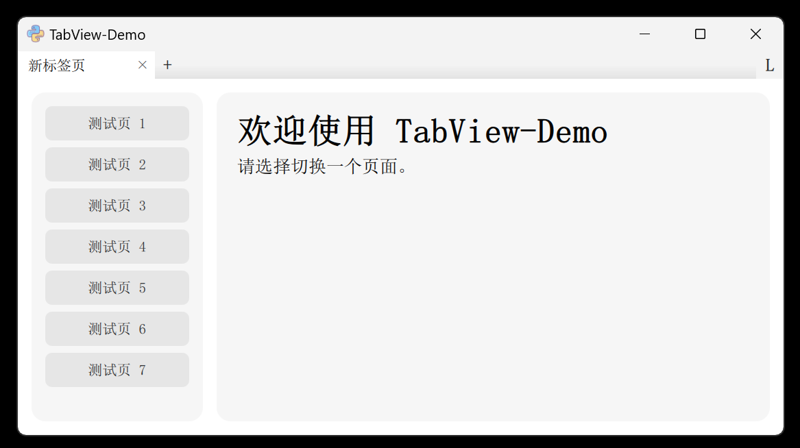
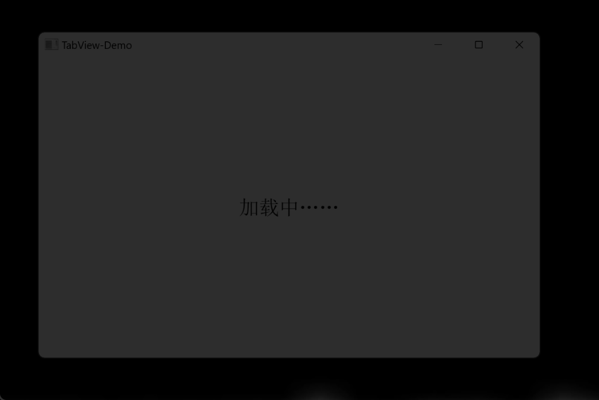
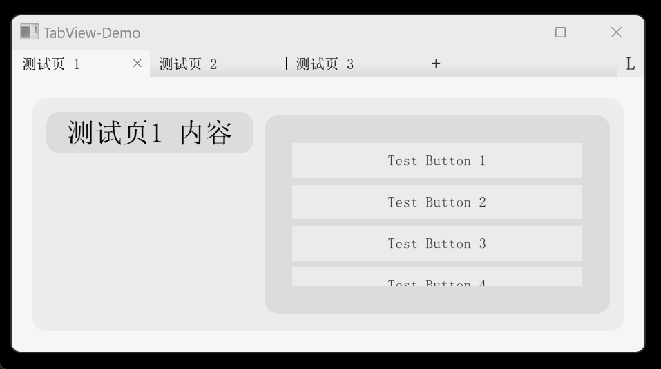
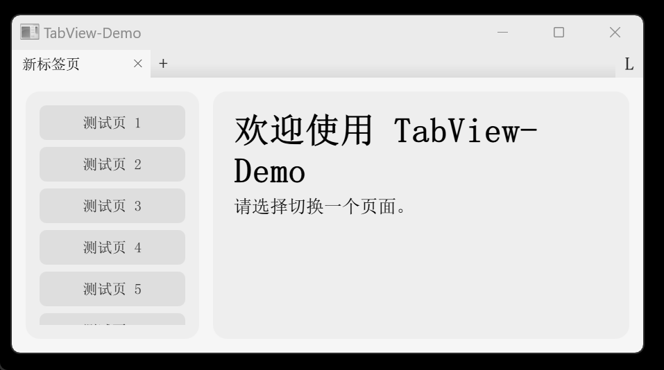
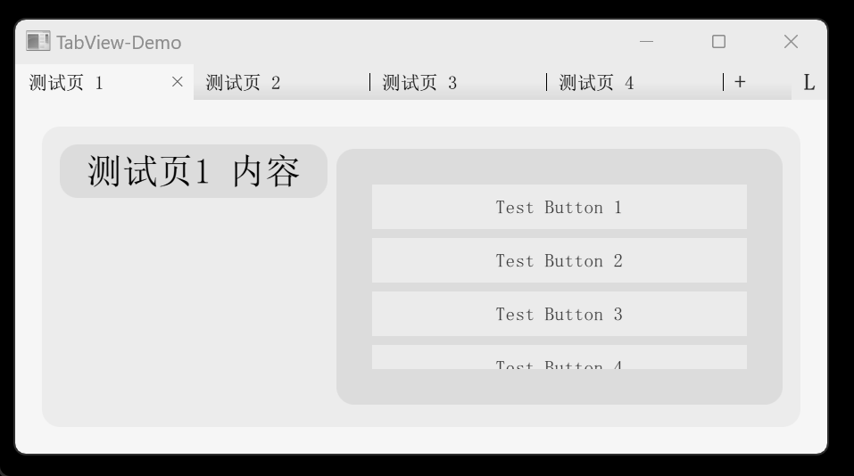
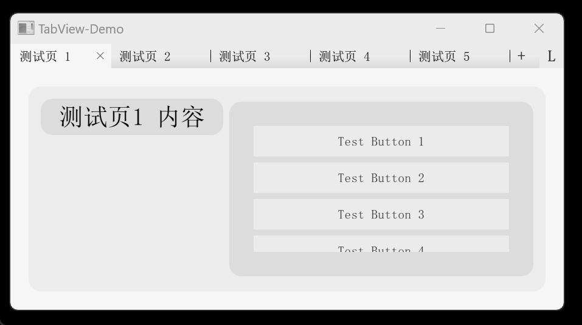

# QML-AutoLoad-TabView



这是一个Qt QML的小demo，演示一种可以自动搜索本地页面文件并加载页面的标签页系统。

可用于设计一个有多种独立功能的软件界面，让用户自由选择应该展示哪些常用功能页面，隐藏不常用功能。

## 动效展示

**<center>启动加载</center>**

会记忆上次的标签页，在启动时自动恢复上次打开的页面。（排除重复的页面）



**<center>改变窗口大小</center>**

标签栏可自适应窗口宽度，让标签按钮保持最合适的宽度。



**<center>导航页</center>**

从导航页出发，可跳转到各个功能页。导航页上也可以展示功能的介绍。


**<center>添加与删除页</center>**



**<center>拖拽标签</center>**



**<center>锁定标签栏</center>**

启用锁定后，将禁止添加、删除、移动标签，仅允许切换，可避免误触。



## QML

所有功能仅通过QT5 QML实现，不依赖其他语言及Qt模块，理论上可以兼容c++及PyQt。

但为了支持自动搜索文件功能，可能不支持打包为qrc资源文件。

## 自动加载

如果想开发新标签页，只需在 `/qml/TabPages` 目录下新建页面文件即可，格式要求：目录名与qml文件名相同。例如想新建一个名为`MyPage`的页面：

`/qml/TabPages/MyPage/MyPage.qml`

然后，无需在其他地方配置任何参数，这个新页面就会在程序启动时自动被加载啦！想删除

## 格式

在页面qml内，必须引入父级目录，并且根元素必须为 `TabPage` 。然后改写一些配置属性。

例：
```qml
import QtQuick 2.15

import ".." // 引入父级目录

TabPage {
    title: qsTr("我的页面") // 页面标题，支持翻译
    index: 3 // 在导航页中的排序位置
    intro: qsTr(`页面简介，支持MarkDown语法。`)

    // 其他页面元素

}
```

