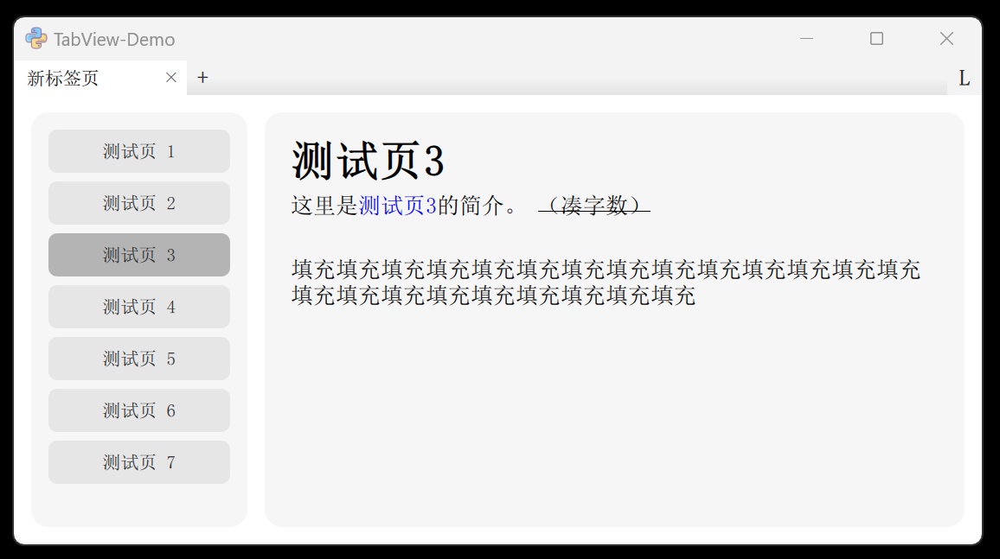

# QML-AutoLoad-TabView

这是一个Qt QML的小demo，演示一种可以自动搜索本地页面文件并加载页面的标签页系统。

另外还有静态加载版本，在 [static-load 分支](https://github.com/hiroi-sora/QML-AutoLoad-TabView/tree/static-load) 。

可用于设计一个有多种独立功能的软件界面，让用户自由选择应该展示哪些常用功能页面，隐藏不常用功能。


## 动效展示

**<center>启动加载</center>**

会记忆上次的标签页，在启动时自动恢复上次打开的页面。（排除重复的页面）


**<center>改变窗口大小</center>**

标签栏可自适应窗口宽度，让标签按钮保持最合适的宽度。


**<center>导航页</center>**

从导航页出发，可跳转到各个功能页。导航页上也可以展示功能的介绍。



**<center>添加与删除页</center>**


**<center>拖拽标签</center>**


**<center>锁定标签栏</center>**

启用锁定后，将禁止添加、删除、移动标签，仅允许切换，可避免误触。


## QML

所有功能仅通过QT5 QML实现，不依赖其他语言及Qt模块，理论上可以兼容c++及PyQt。

但为了支持自动搜索文件功能，可能不支持打包为qrc资源文件。

## 自动搜索

页面管理器会自动搜索并添加 `/qml/TabPages/` 目录下所有符合条件的页面文件。默认在程序主要元素初始化完毕后再开始搜索，期间可以显示一个“加载中……”的提示视图或图片。

搜索功能是在QML前端用 `FolderListModel` 实现的，无需与后端的c++或python交互。

页面文件的规范：要求每个页面放在一个目录内，且目录名与内部的qml文件名相同。例如想新建一个名为`MyPage`的页面，只需在 `/qml/TabPages` 目录下创建：

`/qml/TabPages/MyPage/MyPage.qml`

然后，无需在其他地方配置任何参数，这个新页面就会在程序启动时自动被加载啦！想删除时也是同理，将 `MyPage/` 目录删除即可。


## 页面QML格式

在页面qml内，必须引入父级目录 `import ".."` ，并且根元素必须为 `TabPage` 。然后改写一些配置属性，让搜索器能够识别这个页面的标题、排序和简介信息。

例：
```qml
import QtQuick 2.15

import ".." // 引入父级目录

TabPage {
    // 必选项
    title: qsTr("我的页面") // 页面标题，支持翻译
    index: 3 // 在导航页中的排序位置，允许但尽量不要和别的页面重复
    // 可选项
    intro: qsTr(`# 页面简介，支持MarkDown语法。`)
    onReady: ()=>{ } // 启动事件，代替 Component.onCompleted

    // 其他页面元素
    Text { text: "Hello World!" }

}
```

#### onReady 延迟加载

由于搜索机制，所有页面qml文件会在程序启动后被加载一次。如果需要在页面创建时进行一些长耗时的操作，或者页面上存在极其复杂的元素，可以将这部分内容放在 `onReady` 内。它不会在程序启动但不需要展示该页面时执行。而使用中添加该标签页时， `onReady` 会在页面生成的下一轮事件循环才调用，比 `onCompleted` 更稳定。

```qml
// 代替 Component.onCompleted
onReady: ()=>{ // 注意写法，这是个函数

    // 例：长耗时操作
    initData()
    // 例：加载复杂元素
    myLoader.active = true
}
```

#### Markdown 小技巧

如果想在QML的Markdown（如页面简介intro）中打出空行，可以用1个全角空格+2个常规空格来填充空行。复制下面这行：
```
　  
```